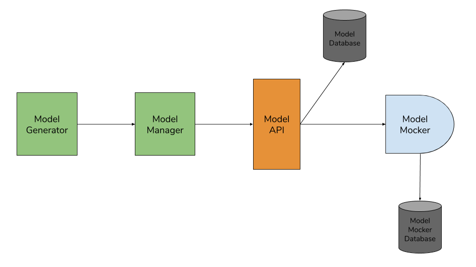

# RestAPI Mocker

## Description

RestAPI Mocker is a toolchain enabling the modelling and the generation of Rest API servers.
Mocked servers support routes, entities, validation rules and a system of data persistence.

## Global Architecture

### Diagram

### Components

- The Model generator is a JavaFX desktop application used to generate Rest api models through simple steps such as declaring routes, their query parameters, body and responses. It also contains a command line interface.

- The Model manager is an Angular web application in which you can import your api models, manage them and deploy them to a Model Mocker.

- The Model API's main purpose is to store, retrieve, manage and handle deployment of user's models stored inside the model database.

- The Model Mocker turns an api model into a powerful Mock server with routes, validation rules
and data persistence.

## Read More

To learn more about RestAPI Mocker, read our docs [here](./docs/index.md).
